=========================
Amazon Web Services (AWS)
=========================

To create an Amazon Web Services (AWS) cluster through `StackPointCloud <http://stackpoint.io>`_ you will need to:

1. Create an AWS user.
2. Create a policy which grants full access to:

  * Autoscaling
  * CloudWatch
  * EC2
  * Elastic Load Balancing
  * IAM
  * Route 53

3. Attach this policy to the user.

**Create an AWS User**

To create a user, sign into `the AWS Management Console <https://console.aws.amazon.com/console/home>`_ and click Services.

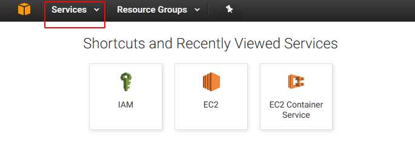

In the **Security and Identity** column, click **IAM**.

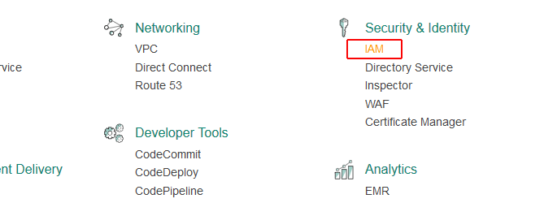

Click **Users**.

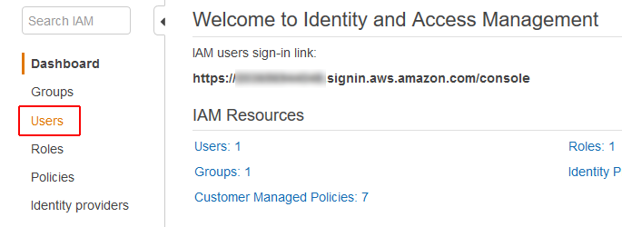

Click **Create New Users**.

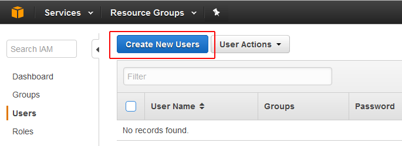

Enter the user name(s) you want to add. Leave the box for **Generate an access key for each user** ticked. Then click **Create**.

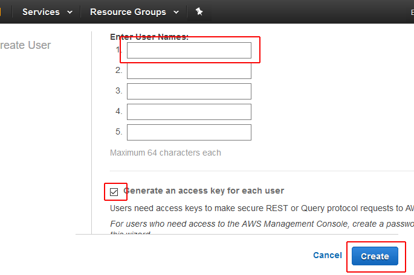

Click **Download Credentials** and save the user's security credentials to your computer.

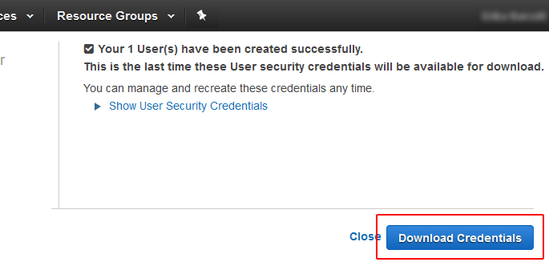

Then click **Close** to return to the **Users** page.

**Create an AWS Policy**

The next step is to create one or more policies which will allow your user to create and manage an AWS cluster.

There are several ways to create policies on AWS. If you are familiar with the IAM policy system, feel free to use your preferred method of creating policies. You will need to allow your user full access to the following services:

* Autoscaling
* CloudWatch
* EC2
* Elastic Load Balancing
* IAM
* Route 53

**Note:** The user will need full IAM access in order to create a role and assign it to an instance. Because this user account will also be able to make changes to your AWS account itself, use your best judgment when assigning these credentials to someone else.

For an easy way to create a single policy to grant all the necessary access, click **Policies**.

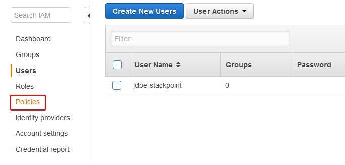

Click **Create Policy**.

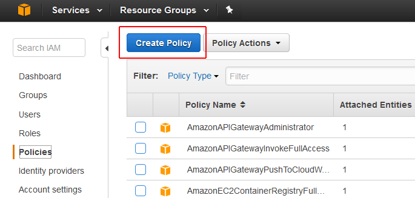

Click to select **Create Your Own Policy**.

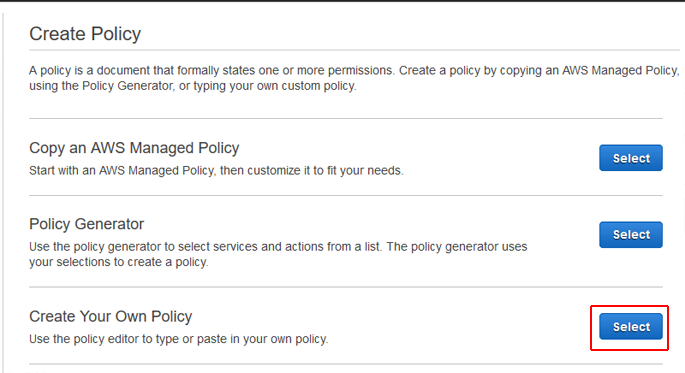

Fill out the **Policy Name** field with a name you will be able to easily remember and search for, like `StackPointCloudPolicy`.

Note that you can only use alphanumeric characters plus a few other characters like `-` and `+`. You cannot use spaces in the policy name.

Copy the following and paste it into the **Policy Document** field: ::

  {
    "Version": "2012-10-17",
    "Statement": [
        {
            "Action": "ec2:*",
            "Effect": "Allow",
            "Resource": "*"
        },
        {
            "Effect": "Allow",
            "Action": "elasticloadbalancing:*",
            "Resource": "*"
        },
        {
            "Effect": "Allow",
            "Action": "cloudwatch:*",
            "Resource": "*"
        },
        {
            "Effect": "Allow",
            "Action": "autoscaling:*",
            "Resource": "*"
        },
        {
            "Effect": "Allow",
            "Action": [
                "route53:*"
            ],
            "Resource": [
                "*"
            ]
        },
        {
            "Effect": "Allow",
            "Action": [
                "elasticloadbalancing:DescribeLoadBalancers"
            ],
            "Resource": [
                "*"
            ]
        },
        {
            "Effect": "Allow",
            "Action": "iam:*",
            "Resource": "*"
        }
    ]
  }

Click **Create Policy** to create the policy and return to the Policy page.

**Attach the Policy to the User**

Click **Users** to return to the Users page.

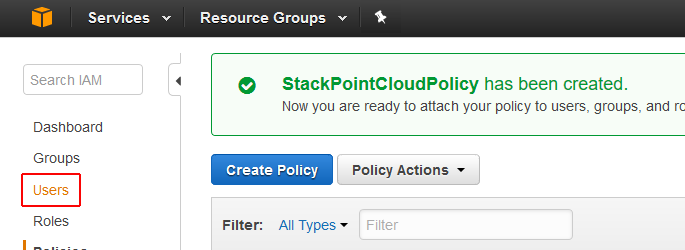

Click your user account to go to the user management page.

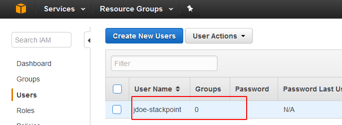

Click the **Permissions** tab, then click **Attach Policy**.

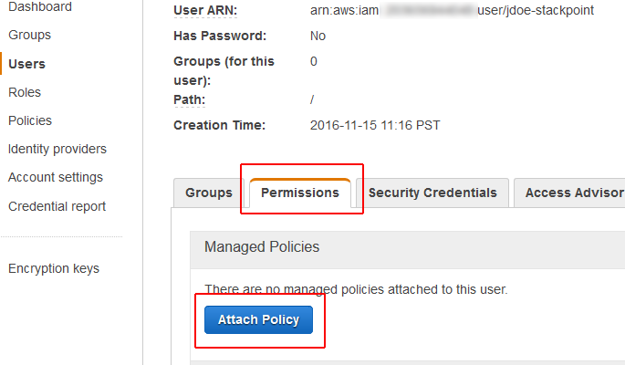

Type the name of your policy into the **Filter** field to locate your policy. Tick the box to select the policy, then click **Attach Policy** to attach it to your user.

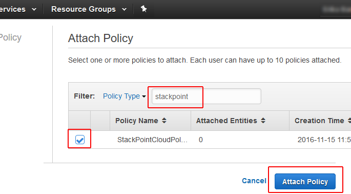

The user account is now ready to be used to create a cluster from `the StackPointCloud website <http://stackpoint.io>`_. The user's Access Key ID and Secret Access Key are in the ``credentials.csv`` file which you downloaded when you created the user.
