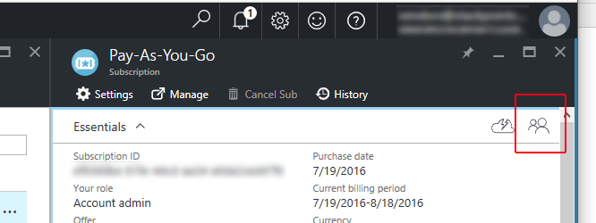

======
Azure
======

In order to access Azure resources, the account must be authorized against the Azure Active Directory. For more information on creating a user account, see `the official Microsoft article <https://azure.microsoft.com/en-us/documentation/articles/active-directory-create-users/>`_).

To create a user account, first log into the Azure classic portal at https://manage.windowsazure.com with the credentials of the account owner.

Click **Active Directory** on the left-hand side of the screen. (Scroll down if necessary.)

Click **Default Directory**.

Click the **Users** tab.

Click **Add User**, which is located at the very bottom of the browser window.

Choose the user type from the drop-down menu, fill out the user name, then click the arrow in the lower right-hand corner to continue.

On the next tab, fill out the user's first and last name and display name. For **Role** select "User." Click the arrow in the lower right-hand corner to continue.

Click the green **Create** button to create the account and get a temporary password for the user. Save this password.

In a different browser, or in an incognito browser tab, go to the `Azure classic portal <https://manage.windowsazure.com>`_ and log in with the user that you just created.

You will be prompted to update the password. Fill out the current (temporary) password, then the new password twice. Click **Update password and sign in** to  set the new password and continue.

The next step is to give the user account access to the subscription.
Log in to https://portal.azure.com with the subscription owner account and click **Subscriptions** on the left-hand side of the screen.

Click the subscription you want to use for this user.

Click the "little people" icon on the right-hand side of the screen.

Click **Subscription admins**.

Click **Assigned To**.

Click **Manage**.

This will take you to the Azure Classic portal. Here, you can enter the user as a co-administrator.

To do this, click **Add**, which is located at the very bottom of the browser window.

Fill out the user's email address, tick the box to select the plan, then click the arrow which will appear in the lower right-hand corner.

This process will create the following three tokens, which you can use for access:

* `AZURE_SUBSCRIPTION_ID`: A 32-character hexadecimal dash-separated string.
* `AZURE_USERNAME`: The email account name, xxxx@domain.com
* `AZURE_PASSWORD`: The new (permanent) password.
