===========================
Google Compute Engine (GCE)
===========================

**Create a New Project**

StackPointCloud must be set up to manage a project within your Google Compute Engine account. To do this, log into the Google cloud console at https://console.cloud.google.com.

Click **Project** to open the drop-down menu.

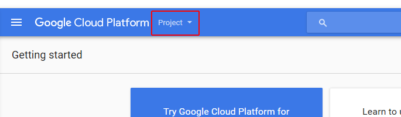

Click **Create Project** on the drop-down menu.

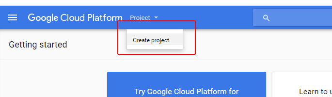

Fill in "StackPointCloud" as the project name, then click **Create**.

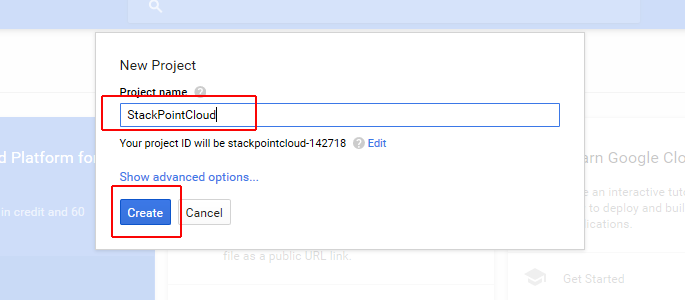

It may take a few moments for the project to be created. Once the task is complete, you will be redirected to the project Dashboard.

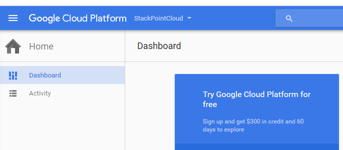

The next step is to use the API Manager to enable the Google Compute Engine API for this project. To do this, scroll down and click **Use Google APIs**.

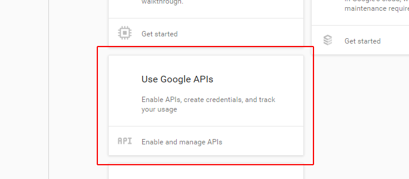

This will take you to the API Manager Dashboard. Click **ENABLE API**.

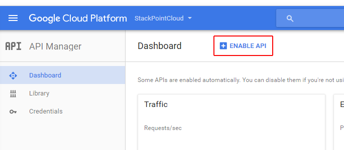

This will take you to the API Library. Click **Compute Engine API**.

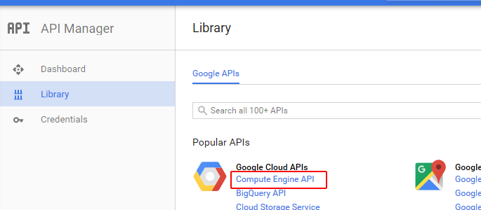

This will take you to the Compute Engine API page. Click **ENABLE** to enable the API.

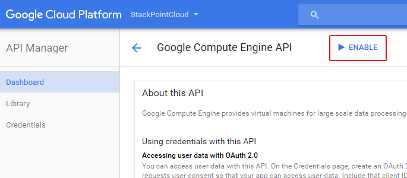

**Create Credentials**

After the new project has been created, Google will prompt you to create credentials by clicking the **Go to Credentials** button.

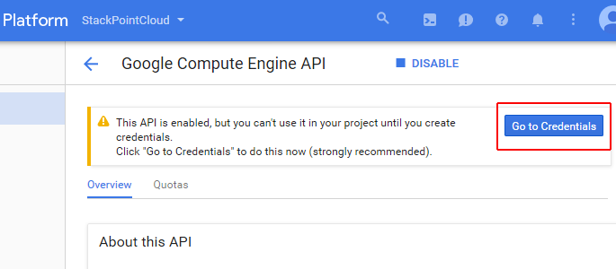

Click the link to skip this step and go directly to **service account**.

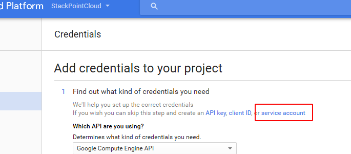

On the Service Accounts page, click **CREATE SERVICE ACCOUNT** to create a new service account.

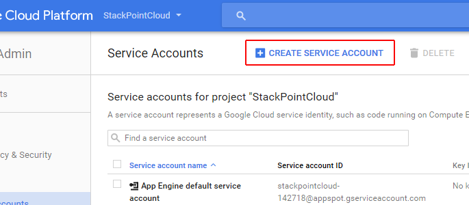

In the **Service Account Name** field, give your account a name like `spc-admin`. For **Role** select **Project** > **Owner**.

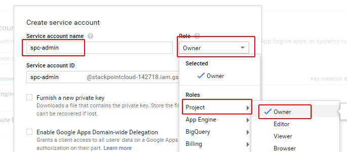

Tick the box to **Furnish a new private key** and select **Key type:** **JSON** then click **Create**.

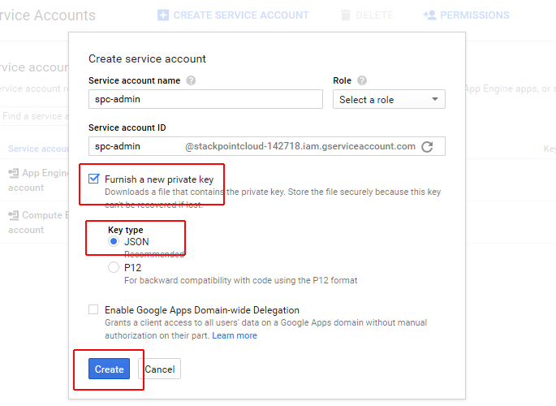

You will be prompted to save the JSON credentials (keyset) to your local computer. Copy and paste these into `the StackPointCloud website <http://stackpoint.io>`_ when you create a new cluster.
